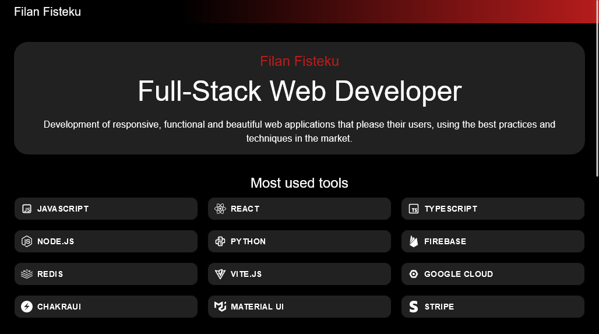

# Filan Fisteku - Full Stack Web Developer Portfolio

This repository contains my personal portfolio website. It showcases my skills, most used tools, and some of the projects I've worked on. The website is built with React, TypeScript, and Material-UI, and bundled with Vite.js for an optimal development experience and efficient production builds.



## Tech Stack

- [React](https://reactjs.org/)
- [TypeScript](https://www.typescriptlang.org/)
- [Vite.js](https://vitejs.dev/)
- [Material-UI](https://mui.com/)

## Features

- Showcases my skills and most used tools with beautiful iconography.
- Displays some of my projects with their respective descriptions and images.
- Fully responsive design, optimized for both mobile and desktop views.

## Installation

To run this project locally, follow these steps:

1. Clone the repository:

```bash
git clone https://github.com/yourusername/portfolio.git
cd portfolio
```

2. Install the dependencies:

```bash
npm install
```

3. Start the development server:

```bash
npm run dev
```

Now you can open [http://localhost:3000](http://localhost:3000) in your browser to see the result.

## Deployment

This project can be easily deployed to any static file hosting service. Here is an example of deploying it to [Netlify](https://www.netlify.com/):

1. Build the project:

```bash
npm run build
```

2. Deploy the `dist` directory to Netlify.

## Contact

If you want to contact me, you can reach me at [@gmail.com](mailto:@gmail.com).

## License

This project uses the [MIT](./LICENSE) license.
